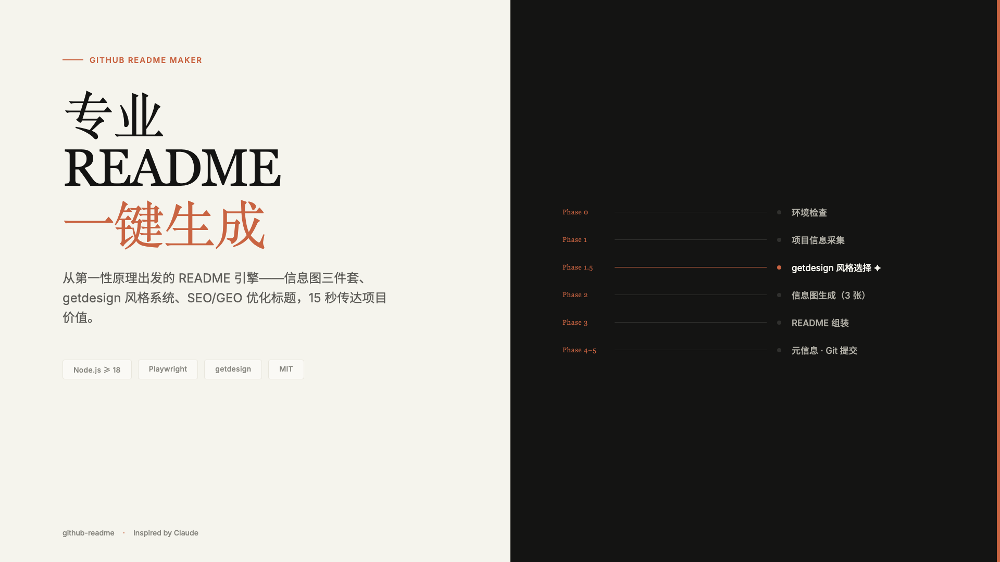
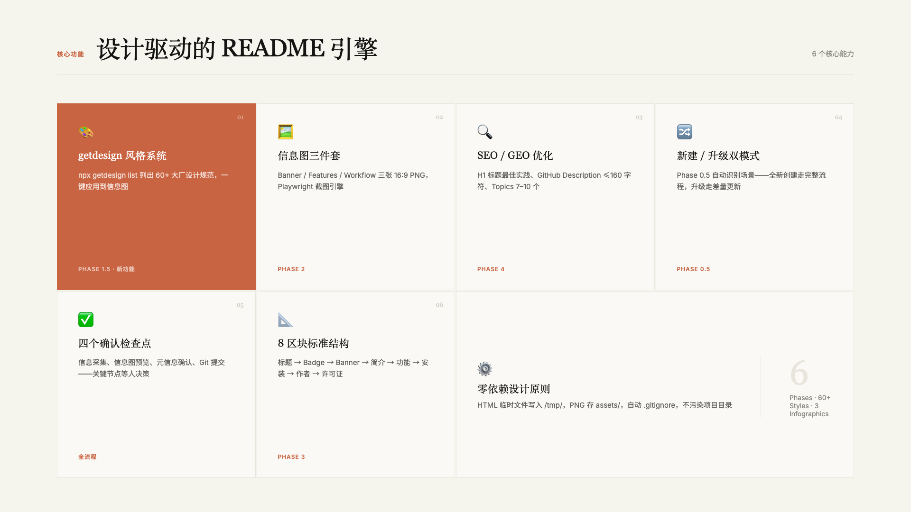
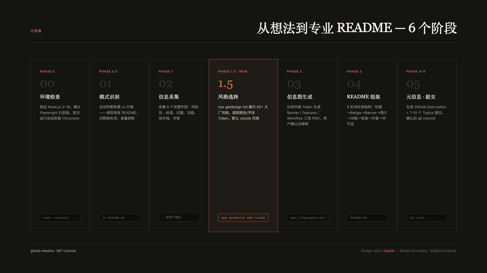

# GitHub README Maker

> 零 ASCII 艺术 · 零 Emoji 堆砌 · 排版驱动设计 · 信息图精准插入

从第一性原理出发：README 是项目的门面，是 Google 和 AI 搜索的入口，是开发者决定是否 star/fork 的第一印象。一个好的 README 需要在 15 秒内传达三件事：**这是什么、能解决什么问题、怎么用**。

---

## 设计哲学

**反模式（绝对避免）：**
- ❌ 用 ASCII 艺术字幕开头（`╔══╗ ◇ Project ◇ ╚══╝`）
- ❌ 第一行就是图片（SEO 不友好，爬虫读不到）
- ❌ Emoji 装饰标题（`## 🚀 功能`——降低专业度）
- ❌ 大段文字没有信息图辅助（阅读疲劳）
- ❌ 缺少 GitHub Topics 和 Description（SEO 失分）

**正确模式：**
- ✅ `# 项目名` H1 + blockquote 标语 → 立即建立认知
- ✅ Badge 行 → 信息密度高，一眼扫描状态
- ✅ 16:9 Banner 信息图 → 视觉冲击，替代 ASCII
- ✅ Features 信息图 + Workflow 信息图 → 核心价值可视化
- ✅ 结构化作者区块 → 表格形式，统一风格

---

## 总体流程

```
Phase 0  环境检查 (Node.js + Playwright)
Phase 1  项目信息采集 (6 个关键字段)
Phase 2  信息图生成 (3 张 HTML → PNG)
Phase 3  README 组装 (8 个标准区块)
Phase 4  GitHub 元信息建议 (description + topics)
Phase 5  Git 提交 (可选，用户确认后)
```

---

## Phase 0: 环境检查

在开始前验证：

```bash
node --version   # 要求 >= 18
```

检查 package.json：
```bash
ls package.json 2>/dev/null || npm init -y
```

检查 Playwright：
```bash
node -e "require('playwright')" 2>/dev/null && echo "OK" || (npm install playwright && npx playwright install chromium)
```

> **为什么需要 Playwright？** 信息图以 HTML 方式编写后通过 Playwright 截图为 PNG，这是在没有设计工具的情况下生成高质量信息图的最佳实践。详见 `scripts/gen_infographic.mjs`。

---

## Phase 0.5: 模式识别

在采集信息前，先判断这是哪种场景——**新建**还是**升级**，后续流程会有所不同。

### 判断规则

| 场景 | 判断条件 | 进入流程 |
|------|----------|----------|
| **全新创建** | 用户没有提到现有文件，或目录内无 README.md | Phase 1 → 2 → 3 → 4 → 5（完整流程） |
| **升级现有** | 用户说「我已有 README」「帮我优化/重构」，或当前目录存在 README.md | 先读取现有文件，再执行 **Phase 1 → 2 → 3（差量更新）→ 4 → 5** |

### 升级现有 README 的差量策略

当识别为「升级」场景时：

1. **读取现有 README**，提取已有内容（项目名、描述、安装方式等）
2. **诊断缺失项**，重点检查：
   - 是否缺少 Banner/Features/Workflow 信息图？→ Phase 2 补充生成
   - H1 标题是否以 ASCII 艺术或图片开头？→ Phase 3 重构开头
   - 是否缺少作者区块？→ Phase 3 补充
   - 是否缺少 GitHub 元信息建议？→ Phase 4 补充
3. **保留用户已有的独特内容**（如详细的 API 文档、贡献指南），不要因为升级而删除

> 升级时告诉用户：「我已读取你的现有 README，会保留原有内容并补充/重构以下部分：[列出差异]」，等用户确认后再继续。

### Fallback 场景

| 异常情况 | 处理方式 |
|----------|----------|
| 用户没有 Git 环境 | Phase 5 跳过，提醒用户手动复制文件 |
| 作者信息完全缺失 | Phase 3 使用占位符 `[your-homepage]`，在 README 末尾注释提醒用户填写 |
| Playwright 截图失败 | 检查 Chromium 路径 → 尝试 `npx playwright install chromium` → 仍失败则跳过信息图，Phase 3 保留 `` 占位（后续可手动替换） |
| 用户只想要文字版（无信息图） | 跳过 Phase 2，Phase 3 中信息图位置改为简洁的功能列表 |

---

## Phase 1: 项目信息采集

向用户询问（或从上下文推断）以下 6 个字段：

| 字段 | 示例 | 说明 |
|------|------|------|
| `project_name` | `Travel Guidebook` | 项目名，首字母大写 |
| `tagline` | `从调研到成书的一站式旅行路书引擎` | 一句话价值主张，≤ 30 字 |
| `problem` | `用 AI 自动生成精排旅行 PDF，替代手动整理攻略` | 解决什么问题 |
| `features` | `并行调研 / 高德地图 MCP / Playwright PDF 导出` | 核心功能，3-6 条 |
| `tech_stack` | `Node.js / Playwright / Claude Code` | 主要技术栈 |
| `author` | 见下方作者结构 | 个人主页/GitHub/Twitter/公众号 |

**作者信息结构：**
```
author:
  homepage: https://example.dev
  github: username
  twitter: @handle
  wechat: 公众号名称（可选）
```

如果用户已在上下文中提供了这些信息，无需重复询问，直接推断并确认。

---

## Phase 2: 信息图生成（核心）

生成 3 张 16:9 HTML 信息图，**截图引擎使用 `scripts/gen_infographic.mjs`**。

### 生成流程（每张图）

```bash
# Step 1: 将 HTML 写入临时文件
cat > /tmp/readme-banner.html << 'EOF'
[HTML 内容]
EOF

# Step 2: 通过 Node.js Playwright 截图
node scripts/gen_infographic.mjs /tmp/readme-banner.html assets/banner.png 1920 1080

# Step 3: 删除临时 HTML（避免污染仓库）
rm /tmp/readme-banner.html
```

> ⚠️ **关键：** 不要把 HTML 文件提交到 git。临时文件写到 `/tmp/`，截图结果保存到 `assets/`。

### 三张信息图规格

**1. Banner（16:9，1920×1080）**
- 用途：README 顶部 hero 图，第一视觉冲击
- 内容：项目名 + 标语 + 核心技术标签 + 视觉背景
- 设计要点：深色/渐变背景，白色大字，右侧技术徽章列表
- 参考模板：`templates/banner.html`

**2. Features（16:9，1920×1080）**
- 用途：核心功能可视化，替代枯燥的 bullet list
- 内容：3-6 个功能卡片，每个卡片含图标 + 标题 + 一行描述
- 设计要点：卡片网格布局，每个卡片有功能色标识
- 参考模板：`templates/features.html`

**3. Workflow/Pipeline（16:9，1920×1080）**
- 用途：工作流程可视化，让用户快速理解运作方式
- 内容：4-6 个阶段的流程图，箭头连接，每阶段有小标题
- 设计要点：横向流程，阶段编号，连接箭头
- 参考模板：`templates/workflow.html`

### 设计系统（保持一致）

参考 `references/design-system.md`，默认采用：
- **背景色**：`#0d1117`（GitHub 深色）或 `#1a1a2e`（深蓝）
- **主色**：项目相关，如科技蓝 `#0ea5e9`、活力橙 `#f59e0b`、自然绿 `#10b981`
- **字体**：`Inter`（无衬线，西文）+ `Noto Sans SC`（中文）
- **圆角**：`12px`，**阴影**：`0 4px 24px rgba(0,0,0,0.3)`

> 三张图的配色主题必须统一——同一主色、同一背景风格。

---

## Phase 3: README 组装

### 标准结构（8 个区块，顺序不可随意调换）

```markdown
<div align="center">

# 项目名

**一句话标语**



[](./LICENSE)
[![...其他 badge...]

</div>

---

## 这是什么

[2-3 句话，说清楚：这是什么、解决什么问题、最大亮点]

```
输入：[示例输入]
输出：[示例输出]
```

---

## 核心特性



[可选：补充 1-2 条文字说明]

---

## 工作流程



---

## 安装

[依赖 + 安装命令]

---

## 快速上手

[最简示例，让用户 5 分钟内跑起来]

---

## 许可证

[MIT](./LICENSE) — 自由使用、修改、分发。

---

## 关于作者

| | |
|:---|:---|
| :globe_with_meridians: 个人主页 | [domain.dev](https://domain.dev) |
| :octocat: GitHub | [username](https://github.com/username) |
| :bird: Twitter | [@handle](https://x.com/handle) |
| :speech_balloon: 公众号 | 微信搜「公众号名」 |
```

### 区块规则

1. **H1 必须在 `<div align="center">` 内**，但 H2 及以下在外面（便于 anchor 链接）
2. **Banner 紧跟 H1**，不超过 3 行文字就出现图
3. **Badge 行**放在 banner 下方，不超过 5 个（保持整洁）
4. **Features 和 Workflow 用纯图片**，不需要再重复文字列表
5. **关于作者用表格**，不用列表，不用 blockquote
6. **最后一定有许可证**，默认 MIT

---

## Phase 4: GitHub 元信息建议

### Repository Description（≤ 160 字符）

格式：`[一句话功能] — [核心技术关键词]`

示例：
```
AI Agent Skill for generating beautifully typeset travel guidebook PDFs with parallel research and Playwright export
```

规则：
- 英文优先（GitHub 国际受众）
- 包含 2-3 个核心技术关键词（供搜索引擎索引）
- 不用 emoji，不用感叹号
- 说「做什么」不说「很厉害」

### Topics（7-10 个）

推荐策略：
1. **技术类**（语言/框架）：如 `nodejs`, `typescript`, `react`
2. **领域类**（应用场景）：如 `travel`, `pdf-generation`, `ai-agent`
3. **工具类**（用到的工具）：如 `playwright`, `claude`, `mcp`
4. **受众类**（目标用户）：如 `developer-tools`, `automation`

示例（travel-guidebook）：
```
agent-skill  claude-code  travel  pdf-generation  playwright
nodejs  mcp  copilot-cli  ai-agent  itinerary
```

---

## Phase 5: Git 提交（可选）

用户确认 README 满意后，询问是否初始化 git 并提交：

```bash
cd [项目目录]
git init
git add README.md assets/ LICENSE
git commit -m "docs: add README with infographics and author section

- Banner, features, workflow 三张 16:9 信息图
- SEO 优化标题和描述
- 结构化作者区块
- MIT 许可证"
```

> 提醒用户：将 HTML 模板文件加入 `.gitignore`（如 `*.html` 临时文件），只提交 PNG 截图结果。

---

## 常见问题处理

**信息图字体不显示？**
HTML 模板中使用了 Google Fonts CDN，需要联网。截图时 Playwright 会自动等待字体加载。如果断网，在 `<style>` 中换成系统字体：`font-family: -apple-system, 'PingFang SC', sans-serif`。

**截图比例不对？**
`gen_infographic.mjs` 的 `--width` 和 `--height` 参数控制视口大小。16:9 = 1920×1080（标准）或 1280×720（轻量）。

**Playwright 找不到 Chromium？**
```bash
npx playwright install chromium
# 或指定路径：
PLAYWRIGHT_BROWSERS_PATH=~/.cache/ms-playwright npx playwright install chromium
```

**如何适配暗色/亮色主题？**
参见 `references/design-system.md` 的主题切换方案。Banner 默认深色背景，如项目风格偏向亮色（如教育类），可切换为 `#fafafa` 背景 + 深色文字。
