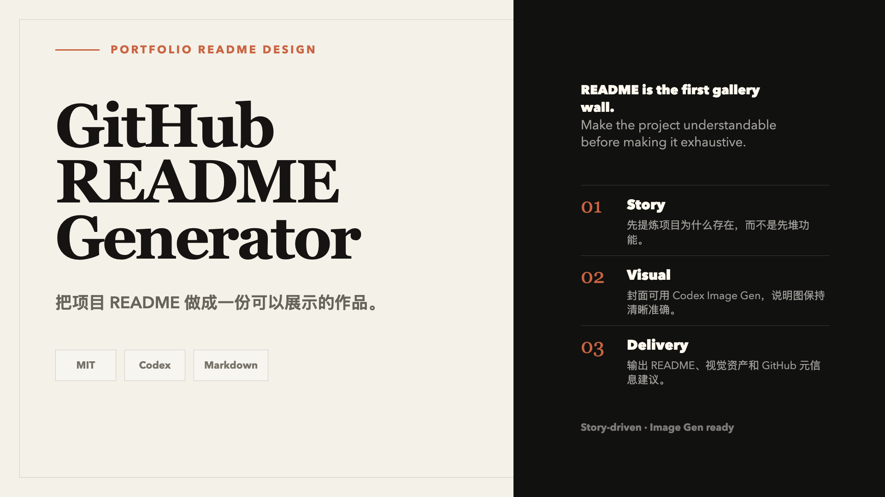
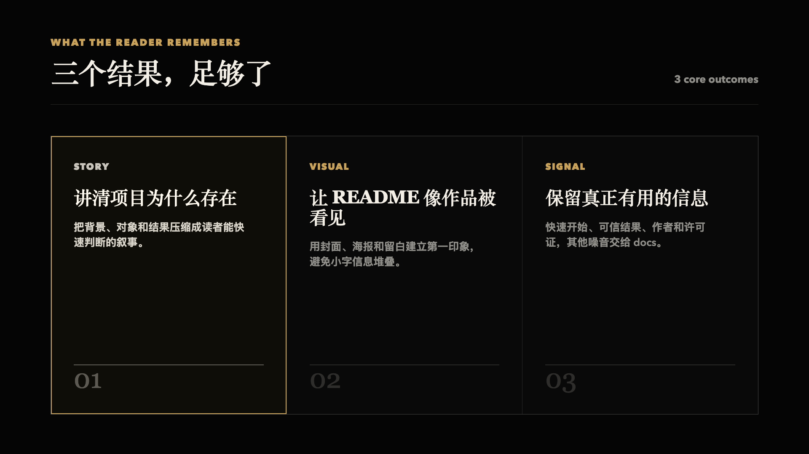
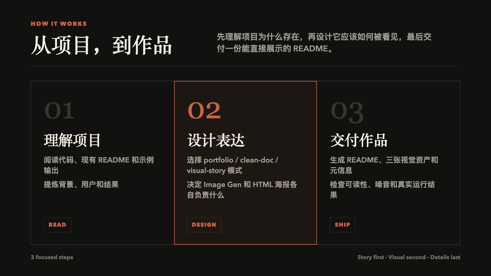

# GitHub README Generator

README 是项目的第一张作品集页面。它不是说明书的目录，也不是功能清单的容器。它要在很短时间内回答三件事：

1. 这是什么。
2. 为什么值得看。
3. 我怎么开始使用。

本 Skill 的目标是生成 **100 分 README 作品**：清楚、有审美、克制、可信，能让项目像一个完整作品一样被理解。

---

## 作品标准

用下面的评分表约束所有输出：

| 维度 | 分值 | 判断标准 |
|------|------|----------|
| 15 秒理解 | 25 | 首屏能看懂项目名、价值、适用对象 |
| 项目故事 | 20 | 不是堆功能，而是讲清背景、动机和结果 |
| 视觉表达 | 20 | 图片像作品，不像小字流程截图 |
| 快速开始 | 15 | 安装和使用路径短、明确、可复制 |
| 可信产物 | 10 | 展示真实输出、能力边界或结果 |
| 克制降噪 | 10 | 去掉重复、口号、过度解释和装饰 |

低于 90 分的 README 不交付；先删噪音、放大重点、重排叙事。

---

## 设计原则

### 必须坚持

- H1 必须是项目正式名称，紧跟一句价值主张。
- README 开头先讲项目价值，再放安装细节。
- 图片只表达一个重点，不能承载密集说明文字。
- GitHub 会缩小图片显示，图片里的主文案必须按海报字号设计。
- 对功能的描述要具体，但不夸张；能用结果说明就不要自夸。
- 对作者和许可证保持简洁，不做社交名片堆砌。

### 必须避免

- ASCII 艺术标题。
- emoji 装饰标题或作者表格。
- 大段“我们很专业”的空话。
- 6 个以上小卡片堆在一张图里。
- 流程图里塞满阶段、命令和小字说明。
- 把 Image Gen 当作精确文字排版工具。
- 把 README 写成完整产品手册；详细文档应放到 `docs/`。

---

## 总体流程

```
Phase 0    项目阅读和模式识别
Phase 1    项目故事提炼
Phase 2    视觉生成方式选择
Phase 3    作品级视觉资产生成
Phase 4    README 组装
Phase 5    GitHub 元信息建议
Phase 6    验证和交付
```

---

## Phase 0: 项目阅读和模式识别

先读取项目，而不是直接写模板。

检查：

```bash
ls
find . -maxdepth 2 -type f | sed 's#^\./##' | sort | head -80
```

优先读取：

- `README.md`
- `package.json` / `pyproject.toml` / `go.mod` / `Cargo.toml`
- `docs/`
- 主要入口文件
- 示例、截图、演示文件

判断场景：

| 场景 | 判断方式 | 策略 |
|------|----------|------|
| 新建 README | 没有 README，或 README 很短 | 完整生成 |
| 升级 README | 已有 README，有有效内容 | 保留独特内容，重写结构和首屏 |
| 作品集强化 | 用户强调审美、故事、展示 | 优先做叙事和视觉 |
| 纯文档模式 | SDK、库、后端工具 | 少图，重安装和 API 示例 |

升级现有 README 时，不要删除用户已有的关键内容。先提取可保留内容，再重排。

---

## Phase 1: 项目故事提炼

采集或推断 7 个字段：

| 字段 | 说明 |
|------|------|
| `project_name` | 项目正式名称 |
| `tagline` | 一句话价值主张，短、有判断 |
| `origin` | 项目出现的背景：为什么需要它 |
| `audience` | 谁会用它 |
| `promise` | 它帮用户得到什么结果 |
| `proof` | 真实能力、截图、输出、示例、指标 |
| `start` | 最短上手路径 |

不要问太多问题。能从项目里推断就直接推断；只有影响叙事准确性时才问用户。

### 推荐叙事结构

```
项目名
一句话价值主张
视觉封面

这是什么
为什么需要它
你会得到什么
快速开始
示例或输出
工作方式
安装
许可证
作者
```

如果项目偏工具或库，可以把“快速开始”提前到“为什么需要它”之后。

---

## Phase 2: 视觉生成方式选择

README 图片有两类：

1. **作品封面**：传达气质、主题、记忆点。
2. **结构说明图**：传达步骤、能力、对比、流程。

根据用户意图选择模式：

| 模式 | 适用场景 | 图片策略 |
|------|----------|----------|
| `portfolio` | 默认推荐，适合多数项目 | Banner 可用 Codex Image Gen，其余用大字 HTML 海报 |
| `clean-doc` | SDK、库、后端工具、严肃基础设施 | 少图或不用图，保留清晰文档结构 |
| `visual-story` | AI 工具、设计工具、独立产品、作品展示 | Codex Image Gen 参与封面和氛围图 |
| `structured` | 用户明确要信息图、流程图 | HTML/CSS 模板生成，保证文字准确 |

默认使用 `portfolio`。用户明确说“用 Image Gen”“用 gpt-image-2”“AI 生成图片”时，启用 Codex 内置图片生成能力。

---

## Phase 3: 作品级视觉资产生成

默认输出仍使用统一文件名：

```
assets/banner.png
assets/features.png
assets/workflow.png
```

这样 README 引用路径稳定，不管图片来自 HTML 截图还是 Codex Image Gen。

### 图片职责

| 图片 | 目标 | 推荐方式 |
|------|------|----------|
| `banner.png` | 项目封面，建立气质和记忆点 | Codex Image Gen 或 HTML 海报 |
| `features.png` | 3 个核心能力，不超过 3 张大卡 | HTML 海报 |
| `workflow.png` | 3 步工作方式，不超过 3 步 | HTML 海报 |

### 字号底线

按 1920×1080 设计时：

| 元素 | 最小字号 |
|------|----------|
| 主标题 | 92px |
| 中文主标题 | 80px |
| 大卡标题 | 48px |
| 正文说明 | 28px |
| 辅助标签 | 22px |
| 页脚 | 20px |

不要使用 18px 以下文字。GitHub 缩放后会不可读。

### HTML 截图方式

用于结构化文字图：

```bash
node scripts/gen_infographic.mjs /tmp/readme-banner.html assets/banner.png 1920 1080
node scripts/gen_infographic.mjs /tmp/readme-features.html assets/features.png 1920 1080
node scripts/gen_infographic.mjs /tmp/readme-workflow.html assets/workflow.png 1920 1080
```

模板来自：

```
templates/banner.html
templates/features.html
templates/workflow.html
```

模板变量：

```
{{PROJECT_NAME}}
{{TAGLINE}}
{{PRIMARY_COLOR}}
{{CATEGORY}}
{{PLATFORM}}
{{LANGUAGE}}
{{VERSION_INFO}}
{{TECH_CARDS}}
{{FEATURE_CARDS}}
{{FEATURE_COUNT}}
{{PIPELINE_STAGES}}
{{STAGE_COUNT}}
```

卡片结构：

`{{TECH_CARDS}}` 用在封面右侧，建议 2-3 条：

```html
<div class="tech-card">
  <div class="tech-icon">01</div>
  <div>
    <div class="tech-name">Story</div>
    <div class="tech-desc">提炼项目背景、价值和读者视角</div>
  </div>
</div>
```

`{{FEATURE_CARDS}}` 只放 3 张大卡，第一张可加 `featured`：

```html
<article class="card featured">
  <div>
    <div class="card-tag">Story</div>
    <h3 class="card-title">讲清项目为什么存在</h3>
    <p class="card-desc">把背景、对象和结果压缩成读者能快速判断的叙事。</p>
  </div>
  <div>
    <div class="rule"></div>
    <div class="card-icon">01</div>
  </div>
</article>
```

`{{PIPELINE_STAGES}}` 只放 3 个阶段，不再插入箭头：

```html
<article class="stage highlight">
  <div>
    <div class="stage-num">02</div>
    <h3 class="stage-title">设计表达</h3>
    <ul class="stage-items">
      <li>选择 portfolio / clean-doc / visual-story / structured 模式</li>
      <li>决定 Image Gen 和 HTML 海报各自负责什么</li>
    </ul>
  </div>
  <span class="stage-badge">Design</span>
</article>
```

### Codex Image Gen / gpt-image-2 方式

当用户指定 Image Gen 时，调用 Codex 自带图片生成能力，不要在项目里临时硬编码 API 脚本。

适合 Image Gen 的内容：

- README 封面。
- 产品氛围图。
- 作品集视觉。
- 抽象概念图。
- 用现有图片做风格延展。

不适合 Image Gen 的内容：

- 精确流程图。
- 大量中文文字。
- 命令、版本、表格。
- 必须逐字准确的 UI 图。

推荐 prompt 结构：

```text
Use case: productivity-visual
Asset type: GitHub README hero banner, 16:9
Project: <project_name>
Story: <origin + promise>
Visual direction: editorial portfolio cover, restrained, premium, high contrast, generous negative space
Composition: one strong visual idea, no dense UI, no small text
Text policy: no body text inside the image; leave clear space for README title if needed
Avoid: emoji, clutter, fake interface text, tiny labels, generic startup gradients
```

如果用户要求三张图都用 Image Gen，先提醒：封面适合，功能和流程图可能出现文字不准。用户确认后再继续。

### 视觉检查

每张图生成后检查：

- 缩小到 GitHub README 显示宽度后仍能读。
- 一张图只讲一个重点。
- 没有小字堆叠。
- 没有过度装饰。
- 视觉风格和项目故事一致。
- Image Gen 图没有错误文字或多余水印。

---

## Phase 4: README 组装

默认结构：

```markdown
<div align="center">

# 项目名

**一句话价值主张**



[](./LICENSE)

</div>

---

## 这是什么

[2-3 句话讲清项目、背景、结果。]

## 为什么需要它

[讲真实问题，不列反模式清单。]

## 你会得到什么



## 工作方式



## 快速开始

[最短可执行路径。]

## 安装

[依赖和安装命令。]

## 许可证

[MIT](./LICENSE)

## 关于作者

[简洁作者信息。]
```

规则：

- 不要超过 3 个 badge，除非项目确实需要状态标识。
- 不要在图片后重复同样的功能列表。
- 不要把“设计原则”“项目结构”“生成内容”都塞进 README；只保留对读者有用的部分。
- 如果有详细说明，放到 `docs/`，README 只做入口。

---

## Phase 5: GitHub 元信息推荐

Repository Description 和 Topics 是 GitHub 搜索、Trending 关联、AI 搜索引用和人工快速判断的入口。它们不是 README 内容，不要写进 `README.md`；只在最终回复里作为独立建议输出。

### First-principles 目标

- **Description** 回答：这个项目为谁创造什么结果。
- **Topics** 回答：这个项目应该被放进哪些搜索桶。
- **推荐数量** 由信号质量决定，不追求多；高质量 7-9 个通常优于铺满 20 个。
- **Trending / SEO / GEO** 三者平衡：既要覆盖热门搜索词，也要保持项目事实准确，方便 AI 引用。

### Description 生成规则

生成 3 个候选，并逐个打分：

```text
[Verb] [specific outcome] for [audience] — [1-3 precise keywords]
```

硬约束：

- 英文优先，≤ 160 字符。
- 动词开头：Design / Generate / Build / Create / Convert / Automate。
- 包含项目最核心的 2-3 个关键词。
- 不用 emoji、感叹号、营销形容词。
- 不写无法从项目事实支撑的能力。

评分：

| 维度 | 分值 | 判断 |
|------|------|------|
| 准确性 | 40 | 是否忠于项目真实能力 |
| 搜索价值 | 25 | 是否覆盖 GitHub / Google 常搜词 |
| AI 可引用性 | 20 | 是否能被 ChatGPT / Claude / Perplexity 直接理解 |
| 克制程度 | 15 | 是否没有夸张和废话 |

星级：

| 分数 | 星级 |
|------|------|
| 90-100 | 5 星，推荐使用 |
| 80-89 | 4 星，可用但可再精简 |
| 70-79 | 3 星，只适合备选 |
| < 70 | 不推荐 |

### Topics 生成规则

先建立候选池，再筛选最终推荐。

候选来源：

- 项目类型：`agent-skill`, `cli-tool`, `developer-tools`, `documentation`
- 核心技术：`nodejs`, `playwright`, `codex`, `image-generation`
- 应用领域：`readme`, `github-readme`, `open-source`, `portfolio`
- 当前趋势：AI agent、image generation、developer tooling、documentation automation
- 项目实际文件和 README 叙事中出现的关键词

筛选规则：

- 推荐 7-9 个，不超过 10 个，除非项目确实横跨多个明确领域。
- Topic 必须小写，只用字母、数字和 hyphen。
- 删除太泛的词：`software`, `tool`, `app`, `github`, `project`, `ai`。
- 删除重复词：`readme` 和 `github-readme` 可以共存；`open-source` 和 `opensource` 只留一个。
- 不为追热门添加不真实 topic。

每个 topic 给出星级和理由：

| 星级 | 含义 |
|------|------|
| 5 星 | 强相关、高搜索价值、应加入 |
| 4 星 | 相关且有发现价值，可加入 |
| 3 星 | 有一定关系，但不够核心 |
| 2 星 | 相关性弱，通常不推荐 |
| 1 星 | 噪音，不加入 |

输出格式：

```text
GitHub Description 推荐：

1. ★★★★★ <description>
   理由：...

2. ★★★★☆ <description>
   理由：...

最终推荐：<description>

GitHub Topics 推荐：

加入：
- ★★★★★ github-readme — 精准描述项目用途
- ★★★★★ agent-skill — 符合项目形态
- ★★★★☆ image-generation — 当项目支持 Image Gen 时加入

不建议加入：
- ★★☆☆☆ ai — 太泛，搜索噪音大
- ★★☆☆☆ github — 太泛，不能帮助分类
```

### 可选 gh CLI 更新

如果用户安装了 `gh`，当前目录已经是 Git 仓库，并且能解析 GitHub remote，可以建议用户让 Agent 用 `gh repo edit` 更新。不要擅自更新；必须先给出将执行的内容并等待用户确认。

检查：

```bash
gh --version
git remote -v
```

建议命令格式：

```bash
gh repo edit OWNER/REPO \
  --description "<final-description>" \
  --add-topic topic-one \
  --add-topic topic-two \
  --add-topic topic-three
```

如果需要替换旧 topics，先读取当前 topics，再只移除明确不推荐的项：

```bash
gh repo view OWNER/REPO --json description,repositoryTopics
gh repo edit OWNER/REPO --remove-topic old-topic --add-topic new-topic
```

### 说明：git 不能更新仓库元信息

`git` 命令不能修改 GitHub 仓库的 Description 或 Topics。原因：Description 和 Topics 是 GitHub 平台元信息，不是 Git 仓库里的 commit、branch、tag 或 remote 配置。

`git remote -v` 只能用来识别 `OWNER/REPO`，不能用来更新元信息。

如果没有 `gh`，只给出推荐值，让用户到 GitHub 页面手动更新；不要提供复杂备选命令。

不要用 README 文件保存这些推荐；它们属于交付时对用户的操作建议。

---

## Phase 6: 验证和交付

交付前必须验证：

```bash
node --version
npm run showcase
file assets/banner.png assets/features.png assets/workflow.png
git status --short
```

如果改了模板或实际图片，必须重新生成 PNG 并打开检查。

最终汇报只说清楚：

- 改了什么。
- 结果怎样。
- 哪些验证跑过。
- 是否还有需要用户决定的点。

不要把实现细节和冗长过程写给用户。
